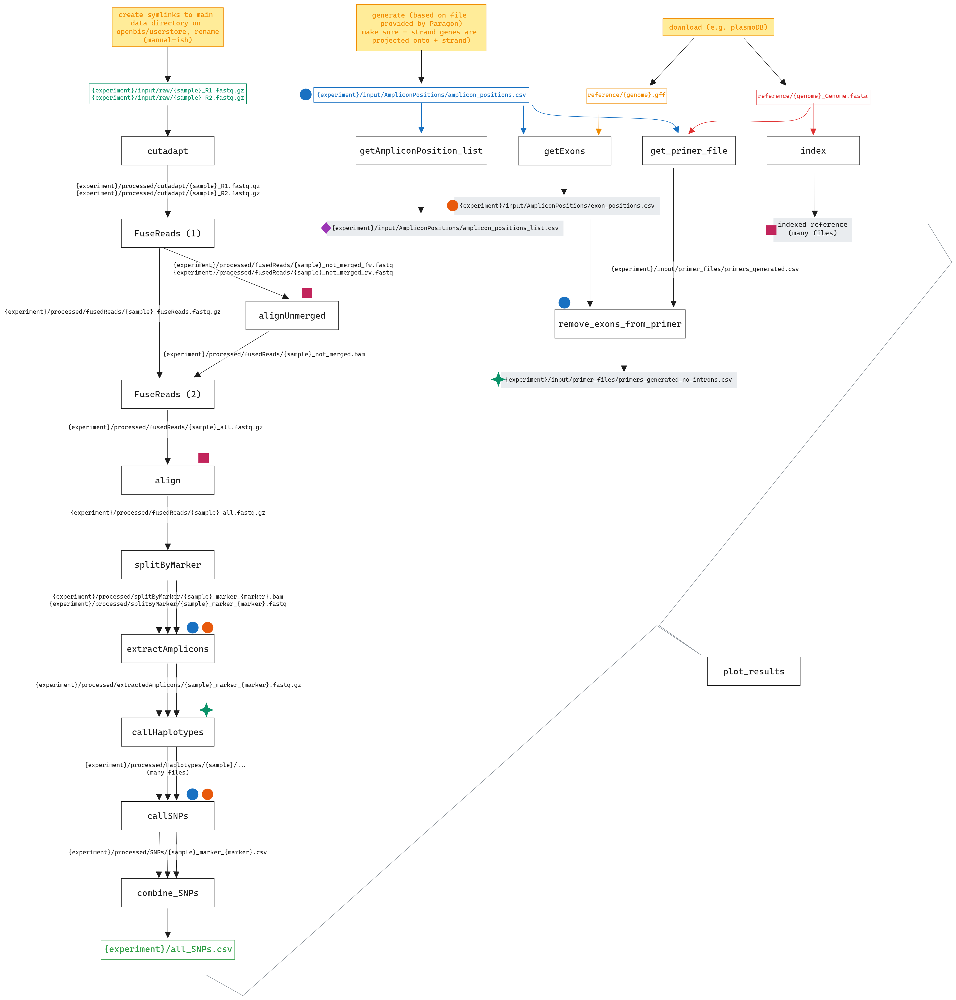

**under development**

*This bioinformatics pipeline is still under active development and is not yet 100% functional. Documentation might be incomplete or lacking and the code is not guaranteed to be bug-free*

# Paragon AmpSeq Pipeline
This is a snakemake analysis pipeline designed to extract haplotypes and SNPs from multiplexed amplicon sequencing experiments using Paragon's amplicon sequencing kits, but can be used for any amplicon sequencing experiment. see [pipeline overview](#Pipeline-overview) for an overview of all the steps in the pipeline.

## Installation and setup
This pipeline works in a linux environment only. 
The pipeline needs a conda environemnt running snakemake and HaplotypR installed. All other dependencies will be installed automatically when needed.



**Warning:** When using this pipeline on Unibas' sciCORE computing cluster, please refer to the internal guide `ParagonAmpseq on SciCORE`



### Install conda/mamba
If you do not yet have conda or mamba installed, install mamba by following the instructions [here](https://github.com/conda-forge/miniforge)

note: mamba and conda provide the same functionality, mamba is just much faster. I recommend using mamba, but everything will work when using conda as well.

### Set up Snakemake Environment
```
mamba create -c conda-forge -c bioconda -n snakemake snakemake
```

### Install HaplotypR	
follow instructions [here](https://github.com/lerch-a/HaplotypR)

### clone this repo
```
git clone git@github.com:EvaEB/ParagonAmpseq.git
```

## Running the pipeline
### Setup
Snakemake relies on the presence and absence of certain files to decide what components to execute next. It is therefore important to not rename files and maintain the directory structure described here

### Experiment Folder
Create a folder within this directory for each independent experiment (e.g. separate sequencing run with differing markers). This will contain the raw & processed data and any files specifically related to this experiment (e.g. what markers and samples are present)


#### sequencing files
the raw sequencing sequencing files should be placed in the folder `{experiment_name}/input/raw`. 
The sequencing files are assumed to already be demultiplexed by sample, and files should be named `{sample}_R1.fastq.gz` for the forward reads and `{sample}_R2.fastq.gz` for the reverse reads, where {sample} is replaced with the sample name of your choice.

Minimal example:
```
📁 raw
├── 🧬 sample1_R1.fastq.gz
├── 🧬 sample1_R2.fastq.gz
```

#### Amplicon positions
In the folder `input/AmpliconPositions` there has to be a file `amplicon_positions.csv` that contains the marker names and the forward/reverse primer positions. This file is the same as that provided by Paragon. If needed, the provided template can be used to create this file manually.

#### Reference 
In the folder `reference`, the reference genome (named `{genome_name}_Genome.fasta` and the reference annotation (named `{genome_name}.gff`) should be present. For *Plasmodium*, these files can be downloaded from [PlasmoDB](https://plasmodb.org/plasmo/app/downloads)

#### markers & samples
These files contain the names of the markers and samples to be analyzed. This makes it possible to only analyze a subset of the sequenced information at one time. Snakemake will only run the pipeline for the samples and markers in these files that are not yet analyzed.

**markers** needs to contain a list of markers, one per line, names matching those specified in `amplicon_positions.csv`

**samples** needs to contain a list of samples, one per line, names matching the files in the raw input

If any samples are missing, the pipeline will not run. Missing markers will result in empty downstream files.

Any lines starting with `#` will be ignored - this can be useful to comment out samples/markers you are currently not interested in.

#### Summary
before running the pipeline, the directory structure should now look like this
(running the pipeline will create several new folders in addition to the ones listed here)

```
├── 📁 envs
│   ├── ...
├── 📁 {experiment_name}
│   ├── 🖹 markers
│   ├── 🖹 samples
│   ├── 📁 input
│   │   ├── 📁 AmpliconPositions
│   │   │   ├── 🖹 amplicon_positions.csv
│   │   ├── 📁 raw
│   │   │   ├── 🧬 {sample}_R1.fastq.gz
│   │   │   ├── 🧬 {sample}_R2.fastq.gz
│   │   │   └── 🧬 ...
├── 📁 reference
│   ├── 🧬 {genome_name}_Genome.fasta
│   └── 🧬 {genome_name}.gff
├── 📁 scripts
│   └── ...
├── 🖹 Snakefile
└── 🖹 Readme.md
```

### Running the pipeline
Once the directory structure is set up, make sure you are in the main directory (`cd ParagonAmpseq`), then enter the following (if more than one core is available, replace `--cores 1` by however many cores available.

When running locally:
```bash
mamba activate snakemake #or whatever you named the environment containing snakemake
snakemake --cores 1 --use-conda --config experiment='{experiment_name}' genome='{genome_name} triplicate='{left|right|None}'
``` 

When running in a cluster environment (e.g. SciCore):
```bash
mamba activate snakemake #or whatever you named the environment containing snakemake
snakemake --cores 1 --use-conda --use-envmodules --config experiment='{experiment_name}' genome='{genome_name}' triplicate='{left|right|None}'
```

replacing `{experiment_name}` and `{genome_name}` by the right values. If these are not provided, they default to `DATA` and `PlasmoDB-62_Pfalciparum3D7` ). 
When the experiment was done in triplicate, indicate this by providing the `--triplicate` option. This can be set to either `left` or `right`, indicating the position in the sample name where the replicate number is positioned. For example, if the samples are named `1_sample`, `2_sample` and `3_sample`, use the option `triplicate='left'`. This option defaults to `None`, indicating no triplicates.


## Output & Further analysis
Once the pipeline has completed, there will be three new folders and one new file in the `{experiment_name}` folder:
```
├── 📁 {experiment_name}
│   ├── ...
│   ├── 📁 logs
│   ├── 📁 plots
│   ├── 📁 processed
│   └── 🖹 all_SNPs.csv
```
`all_SNPs.csv` is the main output. This file contains the SNPs & haplotypes for all samples and markers in the experiment, and can be used for downstream appications. 

`processed` contains all intermediate output, some of which might be useful for analysis. Each pipeline step has its own folder. 

`logs` contains logging files from the pipeline, which are used to create some of the plots and can be used to debug if any issues arise. There will be a folder per pipeline step with one file per time this step was run.

`plots` contains some plots, one per sample
- {sample}_overview_markers.png - diagnostics for haplotype extraction: the length of the bar represents the amount of reads aligning to this marker in total, green part indicates how many of these reads could successfully be used for haplotype calling. Large black proportions indicate many incomplete reads (not fully covering the amplicon, e.g. due to failing to merge), large grey areas indicate likely presence of indels.
- {sample}_highligher.png - an overview of the SNPs present per haplotype for every marker in the sample. 
- {sample}_pipeline.png - an overview of how many reads get processed in each step of the pipeline.  

## Troubleshooting
When the pipeline is running, it will generate a lot of yellow, green and black text. This is normal. 
If the pipeline ends with red text, something went wrong. Read the error (you might need to scroll up a lot). Some possible errors are listed below (this list is not complete)

### `CreateCondaEnvironmentException`
snakemake tried to create or update conda environments from a compute node, but it can't because it doesn't have an internet connection. re-do setup step 7 from a login node, and try again.

### `Error: no Snakefile found, tried Snakefile, snakefile, workflow/Snakefile, workflow/snakefile.`
Make sure you are in the `ParagonAmpseq` folder. If not, navigate to this folder and try again

### `Exiting because a job execution failed. Look above for error message`
something went wrong in one of the pipeline steps. Scroll up until you find red text saying `error in rule ...` to identify where something went wrong. Most commonly, something is wrong with one of the input files. Check these (are the filenames correct? do they contain what you expect?). If this is not the case, you might have encountered a bug. Contact a developer.

## Pipeline overview



